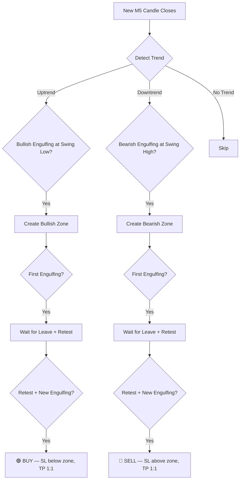

# 🏆 PriceAction Engulfing Zone EA — MT5 Expert Advisor

<div align="center">


-gold?style=for-the-badge)


**A pure price-action Expert Advisor for MetaTrader 5 that trades XAUUSD on the M5 timeframe using an Engulfing Zone Retest strategy.**

*No indicators. No repainting. No Martingale. No Grid. No Hedging.*

</div>

---

## 📖 Table of Contents

- [Overview](#overview)
- [Strategy Logic](#strategy-logic)
- [Features](#features)
- [Installation](#installation)
- [Input Parameters](#input-parameters)
- [How It Works](#how-it-works)
- [Backtesting](#backtesting)
- [Risk Management](#risk-management)
- [Screenshots](#screenshots)
- [FAQ](#faq)
- [License](#license)

---

## Overview

This EA implements a **high-probability, low-frequency** trading strategy based on:

1. **Swing Structure Trend Detection** — Identifies uptrends (Higher Highs + Higher Lows) and downtrends (Lower Highs + Lower Lows) using pure price action.
2. **Engulfing Pattern Recognition** — Detects valid Bullish and Bearish Engulfing candlestick patterns at key swing points.
3. **Supply/Demand Zone Creation** — Creates price zones from the High-to-Low range of engulfing candles.
4. **Zone Retest Confirmation** — Waits for price to leave the zone and return, then looks for a **new** engulfing pattern inside the zone during the retest.
5. **Disciplined Execution** — Opens trades on the next candle with fixed SL/TP at 1:1 risk-to-reward.

---

## Strategy Logic

### 🟢 Buy Strategy

```
1. Market is in an UPTREND (Higher Highs + Higher Lows)
2. A valid Bullish Engulfing forms at a Swing Low
3. → Zone created (High to Low of the engulfing candle)
4. ⛔ First engulfing is NOT traded
5. Price leaves the zone (closes above)
6. Price retests the zone (returns into it)
7. A NEW Bullish Engulfing forms inside the zone
8. ✅ BUY on next candle open
9. SL = Zone Low − buffer
10. TP = 1:1 Risk-to-Reward
```

### 🔴 Sell Strategy

```
1. Market is in a DOWNTREND (Lower Highs + Lower Lows)
2. A valid Bearish Engulfing forms at a Swing High
3. → Zone created (High to Low of the engulfing candle)
4. ⛔ First engulfing is NOT traded
5. Price leaves the zone (closes below)
6. Price retests the zone (returns into it)
7. A NEW Bearish Engulfing forms inside the zone
8. ✅ SELL on next candle open
9. SL = Zone High + buffer
10. TP = 1:1 Risk-to-Reward
```

### Strategy Flowchart



---

## Features

| Feature | Description |
|---|---|
| ✅ Pure Price Action | No lagging indicators — uses swing structure, engulfing patterns, and zones |
| ✅ No Repainting | All decisions based on closed candles only |
| ✅ Auto Lot Sizing | Scales with account balance ($1,000 → 0.04 lot) |
| ✅ Manual Lot Override | Fully adjustable from EA inputs |
| ✅ 1:1 Risk-to-Reward | Fixed TP equal to SL distance |
| ✅ Visual Zone Drawing | Colored rectangles on chart with state-based colors |
| ✅ Max 1 Trade | Only one open position at a time |
| ✅ Spread Filter | Skips trades when spread is too wide |
| ✅ Zone Invalidation | Optional — removes zones on opposite close-through |
| ✅ Detailed Logging | All events logged to Experts tab with emoji markers |
| ❌ No Martingale | — |
| ❌ No Grid | — |
| ❌ No Hedging | — |

---

## Installation

### Step 1: Download

Clone this repository or download the `.mq5` file:

```bash
git clone https://github.com/AurexTrader/PriceAction-EngulfingZone-EA.git
```

### Step 2: Copy to MT5

Copy `PriceAction_EngulfingZone_EA.mq5` to your MetaTrader 5 data folder:

```
<MT5 Data Folder>/MQL5/Experts/PriceAction_EngulfingZone_EA.mq5
```

> 💡 **Tip**: In MT5, go to **File → Open Data Folder** to find your data folder.

### Step 3: Compile

1. Open **MetaEditor** (F4 from MT5)
2. Open the `.mq5` file
3. Press **F7** to compile
4. Verify **0 errors, 0 warnings**

### Step 4: Attach to Chart

1. Open an **XAUUSD M5** chart
2. Drag the EA from the Navigator panel onto the chart
3. In the dialog, check **"Allow Algo Trading"**
4. Configure inputs as desired
5. Click **OK**

---

## Input Parameters

### 💰 Lot Size Settings

| Parameter | Default | Description |
|---|---|---|
| `ManualLotSize` | `0.0` | Manual lot size (0 = auto mode) |
| `LotPer1000` | `0.04` | Lot size per $1,000 balance in auto mode |
| `MaxLotSize` | `2.0` | Maximum lot size cap |
| `MinLotSize` | `0.01` | Minimum lot size |

**Auto Lot Size Table:**

| Balance | Lot Size |
|---|---|
| $1,000 | 0.04 |
| $2,000 | 0.08 |
| $5,000 | 0.20 |
| $10,000 | 0.40 |

### 🛡️ Stop Loss & Take Profit

| Parameter | Default | Description |
|---|---|---|
| `SLBufferPoints` | `50` | Points added beyond zone for SL placement |

### 📊 Swing & Trend Detection

| Parameter | Default | Description |
|---|---|---|
| `SwingLookback` | `3` | Candles on each side for swing point detection |
| `TrendSwingCount` | `4` | Number of swing points to evaluate trend direction |

### 🔄 Zone Management

| Parameter | Default | Description |
|---|---|---|
| `ZoneExitCandles` | `3` | Minimum consecutive candles outside zone |
| `InvalidateZone` | `true` | Remove zone if price closes through it |

### ⚙️ Execution Settings

| Parameter | Default | Description |
|---|---|---|
| `MagicNumber` | `202507` | Unique identifier for this EA's trades |
| `MaxSlippage` | `30` | Maximum allowed slippage in points |
| `MaxSpreadPoints` | `50` | Maximum spread to allow trading |

### 🎨 Visual Settings

| Parameter | Default | Description |
|---|---|---|
| `ShowZones` | `true` | Draw zone rectangles on chart |
| `BullZoneColor` | `DodgerBlue` | Color for bullish (demand) zones |
| `BearZoneColor` | `OrangeRed` | Color for bearish (supply) zones |

---

## How It Works

### Trend Detection

The EA uses **swing point structure** to determine market direction:

- **Uptrend**: The most recent swing highs are progressively higher (Higher Highs) AND swing lows are progressively higher (Higher Lows)
- **Downtrend**: The most recent swing highs are progressively lower (Lower Highs) AND swing lows are progressively lower (Lower Lows)
- **No Trend**: Mixed structure — EA does not trade

### Swing Point Detection

A candle is identified as a **Swing High** if its High is greater than `N` candles on both the left and right side. Similarly for Swing Lows. The lookback `N` is configurable (default: 3).

### Engulfing Pattern Validation

The EA validates engulfing patterns using strict body-based rules:

- **Bullish Engulfing**: Previous candle is bearish, current candle is bullish, and the current candle's body fully engulfs the previous candle's body
- **Bearish Engulfing**: Previous candle is bullish, current candle is bearish, and the current candle's body fully engulfs the previous candle's body

### Zone Lifecycle

```
CREATED → PRICE LEFT → RETESTING → SIGNAL → TRADE OPENED
                                       ↓
                                  INVALIDATED (optional)
```

### Zone Color States

| Color | Meaning |
|---|---|
| DodgerBlue / OrangeRed | Zone active, price still inside |
| LimeGreen / Crimson | Price has left — ready for retest signals |
| DarkGray | Trade already taken from this zone |
| Gray | Zone invalidated |

---

## Backtesting

1. Open **Strategy Tester** in MT5 (`Ctrl+R`)
2. Select **PriceAction_EngulfingZone_EA**
3. Set Symbol to **XAUUSD**, Period to **M5**
4. Choose date range
5. Select **"Every tick based on real ticks"** for most accurate results
6. Click **Start**

> ⚠️ **Important**: Use "Every tick based on real ticks" mode for accurate backtest results. "Open prices only" mode will miss intra-candle price movements.

---

## Risk Management

- **Maximum 1 trade open** at any time
- **Fixed 1:1 Risk-to-Reward** — TP always equals SL distance
- **Auto lot sizing** scales with account balance
- **Spread filter** prevents trading during high-spread conditions
- **Zone invalidation** removes invalid zones to prevent bad entries
- **No duplicate trades** — each zone can only fire one trade

---

## Screenshots

> 📸 *Attach screenshots of the EA running on your XAUUSD M5 chart after deploying.*

---

## FAQ

**Q: Can I use this EA on other symbols?**
A: No. This EA is hardcoded for XAUUSD (Gold) only. It validates the symbol on initialization.

**Q: Can I use other timeframes?**
A: No. The EA only runs on M5 and will reject other timeframes on initialization.

**Q: Does this EA repaint?**
A: No. All decisions are made on fully closed candles (shift ≥ 1). Signals are only executed on the next candle open.

**Q: Can I run multiple instances?**
A: Yes, but use different Magic Numbers for each instance.

**Q: Does it work on ECN/Raw Spread accounts?**
A: Yes. The EA uses `ORDER_FILLING_IOC` which is compatible with most brokers. If you encounter filling issues, the fill mode can be adjusted in the code.

---

## File Structure

```
PriceAction-EngulfingZone-EA/
├── MQL5/
│   └── Experts/
│       └── PriceAction_EngulfingZone_EA.mq5    # Main EA file
├── README.md                                     # This file
├── LICENSE                                        # MIT License
└── .gitignore                                     # Git ignore rules
```

---

## License

This project is licensed under the MIT License — see the [LICENSE](LICENSE) file for details.

---

## Disclaimer

> ⚠️ **Trading involves substantial risk of loss.** This EA is provided as-is for educational and personal use. Past performance does not guarantee future results. Always test thoroughly on a demo account before using on a live account. The developer is not responsible for any financial losses incurred from using this software.

---

<div align="center">

**Built with ❤️ for Gold Traders**

</div>
